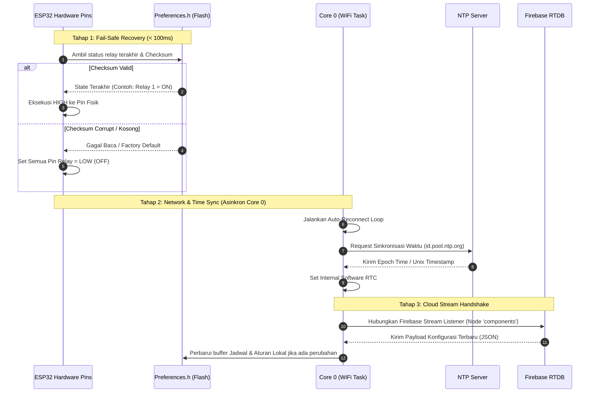
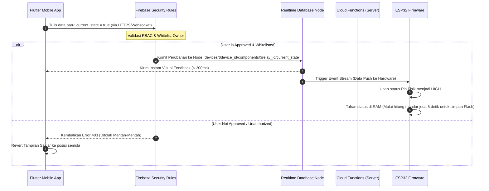
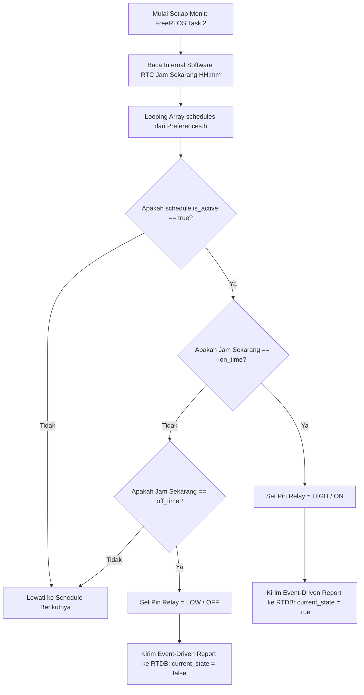
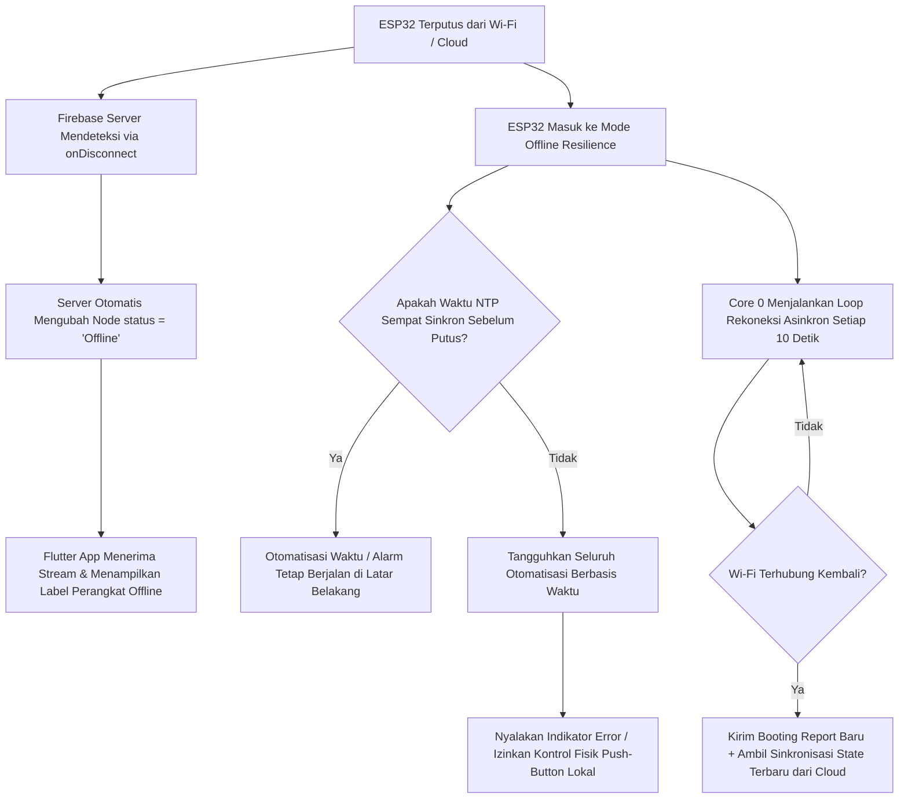

Berikut adalah draf lengkap untuk file **`architecture_flow.md`**. File ini ditulis menggunakan kombinasi penjelasan sekuensial dan diagram berbasis **Mermaid.js** (yang sangat dimengerti oleh Agentic AI seperti Cursor atau Trae) untuk mengunci pemahaman AI mengenai urutan eksekusi sistem saat *booting*, sinkronisasi data, hingga penanganan kondisi *offline*.

---

# ARCHITECTURE FLOW & SYSTEM LIFECYCLE

Dokumen ini mengatur urutan eksekusi (*state lifecycle*), diagram sekuensial, dan percabangan logika untuk ekosistem SmartHome Core. Seluruh komponen (ESP32, Flutter, dan Firebase) wajib mematuhi alur yang didefinisikan di bawah ini.

---

## 1. Booting Sequence (Urutan Inisialisasi Hardware)

Saat ESP32 dinyalakan kembali (*cold boot* atau pasca mati listrik), perangkat wajib mengeksekusi status aman sirkuit terlebih dahulu sebelum membuka soket jaringan. Alur eksekusi dijabarkan dalam diagram berikut:



---

## 2. Data Synchronization Flow (Alur Pertukaran Data Real-Time)

### A. Kontrol Manual via Aplikasi Mobile (Flutter $\rightarrow$ RTDB $\rightarrow$ ESP32)

Ketika pengguna menekan tombol saklar pada aplikasi Flutter, urutan pembaruan data harus mengikuti jalur sub-200ms berikut:



### B. Otomatisasi Waktu Lokal (Internal ESP32 Loop)

Logika eksekusi alarm jadwal dilakukan sepenuhnya di dalam internal chip tanpa memantulkan request ke internet:



---

## 3. Server-Side Hysteresis Logic (Sensor Telemetry Function)

Untuk mencegah kerusakan kumparan relay akibat pembacaan sensor yang berosilasi secara cepat di titik ambang batas (*flapping*), Cloud Functions wajib mengevaluasi aturan berbasis rumus toleransi $1.5^\circ\text{C}$ sebelum memanipulasi *state* database:

```mermaid
graph TD
    A[ESP32 Kirim current_value Sensor Baru ke RTDB] --> B[Cloud Function Terpicu via OnWrite Event]
    B --> C[Parsing Aturannya: Contoh Threshold = 31.0°C, Kondisi = GREATER_THAN]
    C --> D{Apakah current_value > 31.0°C?}
    D -- Ya --> E{Apakah Relay saat ini OFF?}
    E -- Ya --> F[Set current_state Target Relay = true / ON]
    E -- Tidak --> G[Abaikan / Tetap ON]
    
    D -- Tidak --> H{Apakah current_value <= 29.5°C?}
    Note over H: Rumus Deaktivasi Histeresis:<br>Threshold - 1.5°C = 29.5°C
    H -- Ya --> I{Apakah Relay saat ini ON?}
    I -- Ya --> J[Set current_state Target Relay = false / OFF]
    I -- Tidak --> K[Abaikan / Tetap OFF]
    H -- Tidak --> L[Abaikan: Suhu berada dalam rentang toleransi flapping]

```

---

## 4. Offline State Handling & Connection Loss

Sistem harus menangani kehilangan koneksi internet atau kegagalan sinkronisasi waktu (*NTP timeout*) dengan parameter aman (*fail-safe*) sebagai berikut:



---

### Aturan Tambahan untuk Agentic AI:

* Ketika mengimplementasikan kode program, pastikan struktur *percabangan kondisional* (`if-else`) pada blok kode Anda merefleksikan diagram alur di atas secara presisi.
* Jangan pernah menyisipkan fungsi pembersihan memori flash (`Preferences.clear()`) secara otomatis pada alur penanganan error koneksi internet. Data lokal harus dipertahankan dalam kondisi apa pun kecuali saat *hardware factory reset* dipicu secara fisik.